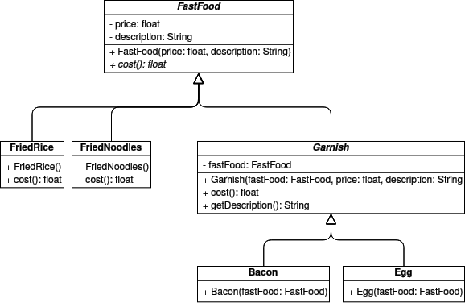

# DesignPatterns

This repository contains exercises and their solutions for an E-Learning unit about design patterns in software design. 

## Patterns

The following design patterns are used in the exercises. The UML class diagrams visualize the code structure. 

### Builder

Builder is a creational design pattern that lets you construct complex objects step by step. The pattern allows you to produce different types and representations of an object using the same construction code.

### Decorator

Decorator is a structural design pattern that lets you attach new behaviors to objects by placing these objects inside special wrapper objects that contain the behaviors.

### Observer

Observer is a behavioral design pattern that lets you define a subscription mechanism to notify multiple objects about any events that happen to the object they’re observing. 

